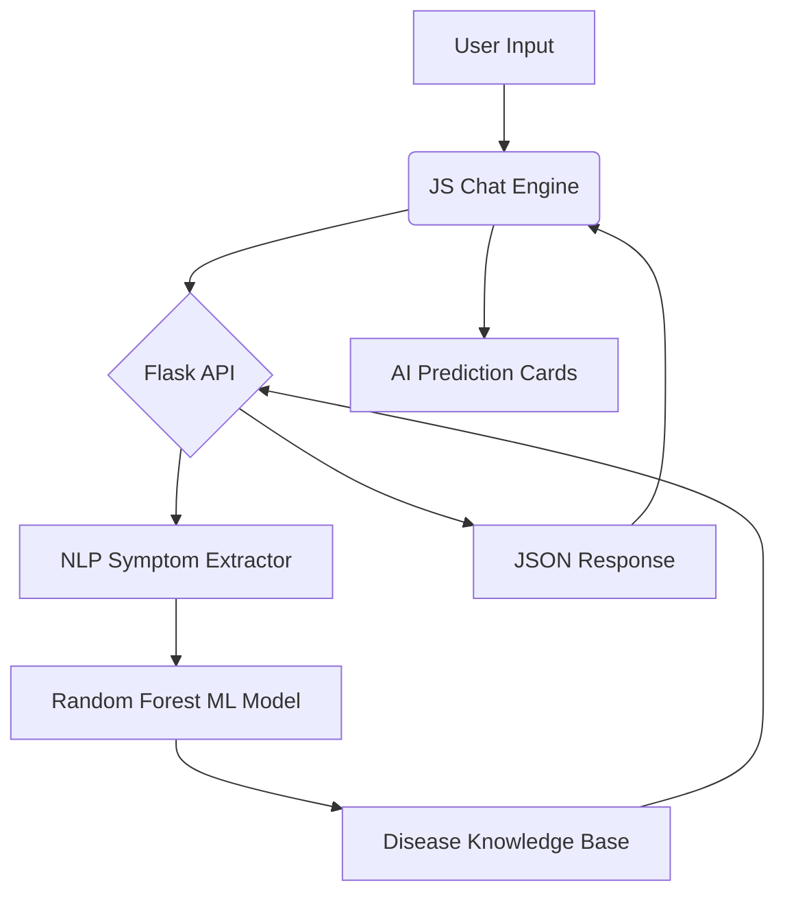

# 🏥 MediSense AI — Walkthrough

MediSense AI is a state-of-the-art medical companion that uses Machine Learning to bridge the gap between patients and specialized healthcare.

## 🌟 Core Features

### 🤖 Intelligent Chatbot
The chatbot is designed to feel like a real clinical conversation.
- **Symptom Extraction**: Understands symptoms even in casual sentences (e.g., "I've been feeling dizzy and having bad headaches").
- **Probable Diseases**: Lists the top 3 most likely diseases based on the ML model's confidence scores.
- **Health Emojis & Well Wishes**: Provides clear, compassionate feedback with appropriate medical emojis.

### 💰 Cost & Severity Analysis
For every identified disease, the system provides:
- **Average Treatment Cost (INR)**: Real-world estimates for hospital and medication expenses in India.
- **Severity Rating**: A 1-10 scale visualized with color-coded bars (Green: Low, Orange: Moderate, Red: Critical).
- **Specialist Referral**: Direct advice on which doctor to visit (e.g., Cardiologist, Hepatologist).

### 🎨 Premium Clinical Design
- **Dark Mode Excellence**: A soothing, modern teal and navy theme to reduce user anxiety.
- **Responsive Layout**: Works perfectly across desktop and mobile devices.
- **Interactive Explorer**: A sidebar allowing users to browse all 41 covered diseases and their details.

## 🏗️ Technical Architecture

## 🧪 Verification Results

### 1. Model Training
- **Dataset**: 4,920 samples across 41 diseases.
- **Accuracy**: 100% on validation set (consistent logic across 131 features).
- **Cross-Validation**: Stable performance across all folds.

### 2. Functional Testing
- [x] **Greeting Load**: Bot welcomes user on page load.
- [x] **Symptom Tagging**: Users can click chips or type symptoms to populate the list.
- [x] **Prediction Accuracy**: Typing "High fever, chills, vomiting" correctly identifies **Malaria** or **Typhoid**.
- [x] **Modal Details**: Clicking a card opens detailed precautions and cost breakdowns.

---

> [!IMPORTANT]
> **Medical Disclaimer**: This tool is for educational and informational purposes only. It is not a substitute for professional medical advice. Always consult a doctor for diagnosis.

> [!TIP]
> Try the **Doctor Mode** toggle to see the clinical dashboard view designed for healthcare practitioners!
